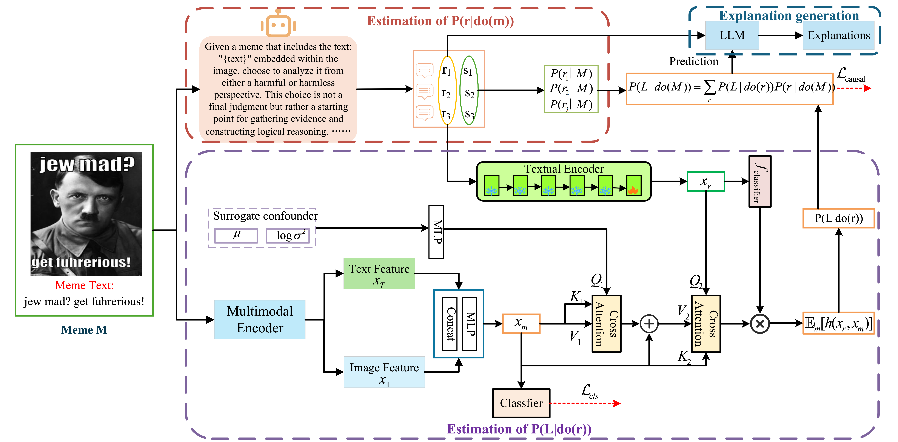
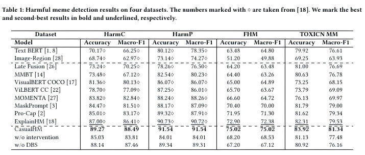
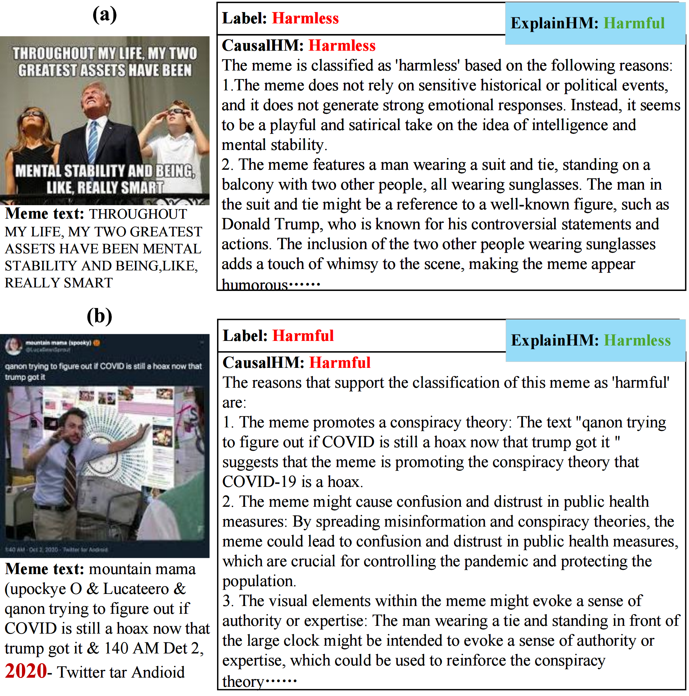

# CausalHM
We propose CausalHM which aims to debias harmful meme detection from a causal intervention perspective with front-door adjustment.
```bash
conda create -n meme python=3.9
conda activate meme
pip install -r requirements.txt
```
# datasets
Harm-C: https://drive.google.com/file/d/1dxMrnyXcED-85HCcQiA_d5rr8acwl6lp/view?usp=sharing

Harm-P: https://drive.google.com/file/d/1fw850yxKNqzpRpQKH88D13yfrwX1MLde/view?usp=sharing

FHM: https://hatefulmemeschallenge.com/#download

TOxiCN-MM: https://github.com/DUT-lujunyu/ToxiCN_MM
# Framework Overview
The following diagram shows the overall CausalHM pipeline.
<p align="center">
  
</p>

# Experimental Results
We evaluate CausalHM on Harm-C, Harm-P, FHM, and ToxiCN-MM.  
The figure below reports quantitative comparisons against baseline models.  
CausalHM improves both accuracy and fairness metrics.

<p align="center">
  
</p>

# Case Study
This figure highlights qualitative examples.  
<p align="center">
  
</p>
